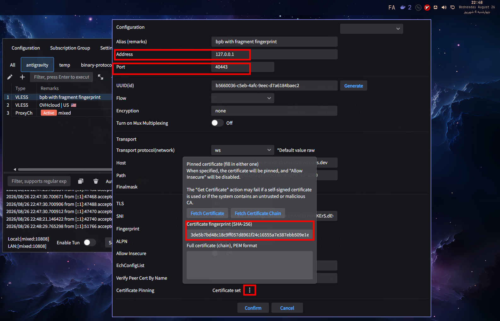

# Client Configuration & Antigravity Bypass Guide

This guide explains how to configure GUI proxy clients and set up parameters to bypass restrictions in tools like **Antigravity**.

> 📖 **[راهنمای فارسی: CLIENT_CONFIG.md](CLIENT_CONFIG.md)** | 🌐 **[Back to Main README](README.en.md)**

---

## 🛡️ Step-by-Step Client Setup

To successfully bypass sanctions and censorship for **Antigravity**:

1. **Start Core First:** Make sure the local core service is running according to [Core Setup Guide](CORE_SETUP.en.md).
2. **Import Config:** Open your proxy client and add/import your server configuration:
   - [PattN GUI Client](https://github.com/patterniha/PattN)
   - [v2rayN GUI Client](https://github.com/2dust/v2rayN)
3. **Edit Configuration Details:** Open the imported configuration settings and adjust:
   - **Address:** `127.0.0.1` (or local LAN IP)
   - **Port:** `40443`
   - **Certificate fingerprint (SHA-256):**
     ```text
     3de5b7bd48c18c9ff057d8961f24c16555a7e387ebb509e1efb1315303695c82
     ```

---

## 🖼️ Visual Client Setup Reference

Set the Address, Port, and Certificate Pinning SHA-256 as shown in the screenshot:



---

## 💡 Antigravity Pro Tip

> [!TIP]
> **Proxy Chaining for Maximum Stability:**  
> For maximum stability and optimal bypass performance in Antigravity, it is recommended to **chain (relay)** this configuration with another proxy config (preferably with a **US location**).
